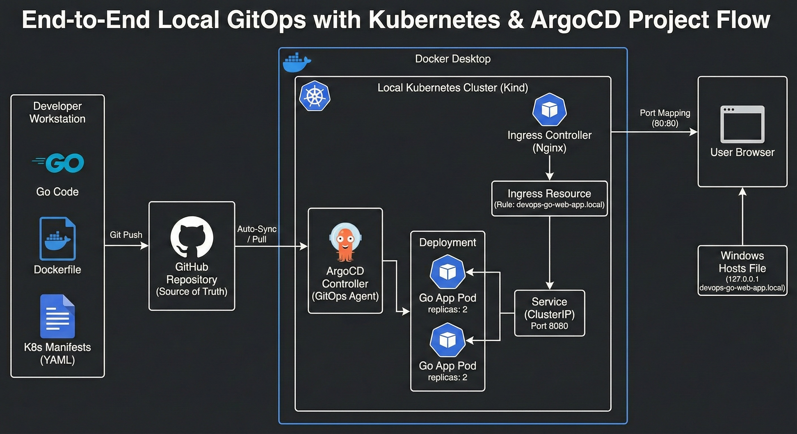

# Go-Web-App-DevOps: End-to-End GitOps Pipeline
This project demonstrates a production-grade GitOps workflow for a Go-based web application. It transitions from a simple containerized app to a self-healing infrastructure managed by Kubernetes and ArgoCD.

## Project Overview
The goal of this project was to move away from manual "imperative" deployments (kubectl apply) toward a "declarative" GitOps model. This ensures that the infrastructure is always in sync with the source code stored in GitHub.

Core Tech Stack

    - Language: Go (Golang)

    - Containerization: Docker

    - Orchestration: Kubernetes (Kind - Kubernetes in Docker)

    - Networking: Ingress-Nginx Controller

    - Continuous Deployment: ArgoCD (GitOps)

## Architecture




### Setup and Installation

#### 1. Cluster Creation

```
kind create cluster --config kind-config.yaml
```

#### 2. Deploy Ingress Controller
```
kubectl apply -f https://raw.githubusercontent.com/kubernetes/ingress-nginx/main/deploy/static/provider/kind/deploy.yaml
```

#### 3. GitOps Setup (ArgoCD)
```
kubectl create namespace argocd
kubectl apply -n argocd -f https://raw.githubusercontent.com/argoproj/argo-cd/stable/manifests/install.yaml
```


### License & Credits

    - Inspiration: This project follows the architecture taught by Abhishek Veeramalla.

    - License: This project is licensed under the Apache License 2.0. See the LICENSE file for details.